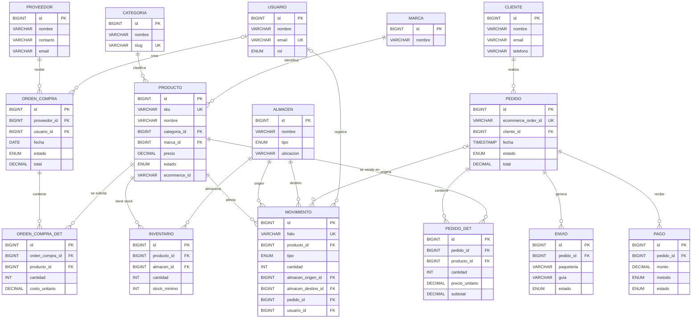

# APIGEST: documentación de la base de datos

## 1. Descripción general

APIGEST utiliza MySQL 8 con el motor InnoDB y codificación `utf8mb4`. La base de datos `apigest` soporta:

- Catálogo de productos, categorías y marcas.
- Inventario distribuido entre almacenes.
- Registro de movimientos de stock.
- Clientes, pedidos, pagos y envíos.
- Proveedores y órdenes de compra.
- Usuarios con distintos roles de operación.
- Sincronización opcional con un e-commerce mediante identificadores externos.

El script de instalación se encuentra en [`apigest_schema.sql`](apigest_schema.sql).

## 2. Diagrama entidad-relación

El siguiente diagrama representa las relaciones definidas mediante claves foráneas en el esquema:



### Cardinalidades

- `||--o{`: una fila del lado izquierdo puede relacionarse con cero o muchas filas del lado derecho; la fila derecha pertenece a una fila del lado izquierdo.
- `o|--o{`: la relación con la fila del lado izquierdo es opcional y puede tener cero o muchas filas relacionadas.
- `PK`: clave primaria.
- `FK`: clave foránea.
- `UK`: columna con restricción `UNIQUE`.

## 3. Catálogo de tablas

### 3.1 `categoria`

Catálogo de categorías de productos.

| Campo | Tipo | Reglas | Descripción |
|---|---|---|---|
| `id` | `BIGINT UNSIGNED` | PK, autoincremental | Identificador de la categoría. |
| `nombre` | `VARCHAR(100)` | NOT NULL | Nombre visible de la categoría. |
| `slug` | `VARCHAR(120)` | UNIQUE, opcional | Identificador amigable para URLs o integraciones. |

### 3.2 `marca`

Catálogo de marcas asociadas a los productos.

| Campo | Tipo | Reglas | Descripción |
|---|---|---|---|
| `id` | `BIGINT UNSIGNED` | PK, autoincremental | Identificador de la marca. |
| `nombre` | `VARCHAR(100)` | NOT NULL | Nombre comercial de la marca. |

### 3.3 `producto`

Catálogo central de artículos que se venden y controlan en inventario.

| Campo | Tipo | Reglas | Descripción |
|---|---|---|---|
| `id` | `BIGINT UNSIGNED` | PK, autoincremental | Identificador del producto. |
| `sku` | `VARCHAR(50)` | NOT NULL, UNIQUE | Código interno único del producto. |
| `nombre` | `VARCHAR(200)` | NOT NULL | Nombre del producto. |
| `descripcion` | `TEXT` | Opcional | Descripción comercial o técnica. |
| `categoria_id` | `BIGINT UNSIGNED` | FK, opcional | Referencia a `categoria.id`. |
| `marca_id` | `BIGINT UNSIGNED` | FK, opcional | Referencia a `marca.id`. |
| `precio` | `DECIMAL(10,2)` | NOT NULL, default `0` | Precio de venta. |
| `estado` | `ENUM` | Default `disponible` | `disponible`, `bajo_stock` o `agotado`. |
| `ecommerce_id` | `VARCHAR(50)` | Opcional, indexado | Identificador del producto en el e-commerce. |
| `created_at` | `TIMESTAMP` | Default actual | Fecha de creación. |
| `updated_at` | `TIMESTAMP` | Actualización automática | Fecha de la última modificación. |

### 3.4 `almacen`

Ubicaciones físicas o estados logísticos donde puede existir inventario.

| Campo | Tipo | Reglas | Descripción |
|---|---|---|---|
| `id` | `BIGINT UNSIGNED` | PK, autoincremental | Identificador del almacén. |
| `nombre` | `VARCHAR(100)` | NOT NULL | Nombre del almacén o tienda. |
| `tipo` | `ENUM` | Default `tienda` | `central`, `tienda` o `transito`. |
| `ubicacion` | `VARCHAR(200)` | Opcional | Dirección o referencia física. |

### 3.5 `inventario`

Existencias de cada producto por almacén. La combinación `producto_id` + `almacen_id` es única.

| Campo | Tipo | Reglas | Descripción |
|---|---|---|---|
| `id` | `BIGINT UNSIGNED` | PK, autoincremental | Identificador del registro de inventario. |
| `producto_id` | `BIGINT UNSIGNED` | FK, NOT NULL | Producto almacenado. Al eliminar el producto, se elimina este registro. |
| `almacen_id` | `BIGINT UNSIGNED` | FK, NOT NULL | Almacén donde se encuentra el stock. |
| `cantidad` | `INT` | NOT NULL, default `0` | Existencia actual. |
| `stock_minimo` | `INT` | NOT NULL, default `0` | Nivel mínimo para alertas de reposición. |

### 3.6 `usuario`

Usuarios internos que operan el sistema.

| Campo | Tipo | Reglas | Descripción |
|---|---|---|---|
| `id` | `BIGINT UNSIGNED` | PK, autoincremental | Identificador del usuario. |
| `nombre` | `VARCHAR(150)` | NOT NULL | Nombre del usuario. |
| `email` | `VARCHAR(150)` | NOT NULL, UNIQUE | Correo de acceso. |
| `password` | `VARCHAR(255)` | NOT NULL | Contraseña almacenada; debe guardarse con hash desde la aplicación. |
| `rol` | `ENUM` | Default `almacenista` | `admin`, `almacenista` o `consulta`. |
| `created_at` | `TIMESTAMP` | Default actual | Fecha de alta. |

### 3.7 `cliente`

Datos del cliente que realiza pedidos.

| Campo | Tipo | Reglas | Descripción |
|---|---|---|---|
| `id` | `BIGINT UNSIGNED` | PK, autoincremental | Identificador del cliente. |
| `nombre` | `VARCHAR(150)` | NOT NULL | Nombre completo o razón social. |
| `email` | `VARCHAR(150)` | Opcional | Correo de contacto. |
| `telefono` | `VARCHAR(30)` | Opcional | Teléfono de contacto. |
| `direccion` | `TEXT` | Opcional | Dirección del cliente. |

### 3.8 `pedido`

Cabecera de una venta o pedido recibido desde el e-commerce.

| Campo | Tipo | Reglas | Descripción |
|---|---|---|---|
| `id` | `BIGINT UNSIGNED` | PK, autoincremental | Identificador interno del pedido. |
| `ecommerce_order_id` | `VARCHAR(50)` | UNIQUE, opcional | Identificador del pedido en el e-commerce. |
| `cliente_id` | `BIGINT UNSIGNED` | FK, opcional | Cliente que realizó el pedido. |
| `fecha` | `TIMESTAMP` | Default actual | Fecha de registro. |
| `estado` | `ENUM` | Default `pendiente` | `pendiente`, `pagado`, `enviado`, `entregado` o `cancelado`. |
| `total` | `DECIMAL(10,2)` | NOT NULL, default `0` | Total de la operación. |

### 3.9 `pedido_det`

Detalle de productos incluidos en un pedido.

| Campo | Tipo | Reglas | Descripción |
|---|---|---|---|
| `id` | `BIGINT UNSIGNED` | PK, autoincremental | Identificador del detalle. |
| `pedido_id` | `BIGINT UNSIGNED` | FK, NOT NULL | Pedido al que pertenece; se elimina con el pedido. |
| `producto_id` | `BIGINT UNSIGNED` | FK, NOT NULL | Producto vendido. |
| `cantidad` | `INT` | NOT NULL | Unidades solicitadas. |
| `precio_unitario` | `DECIMAL(10,2)` | NOT NULL | Precio aplicado por unidad. |
| `subtotal` | `DECIMAL(10,2)` | NOT NULL | Importe del detalle. |

### 3.10 `pago`

Pagos asociados a los pedidos.

| Campo | Tipo | Reglas | Descripción |
|---|---|---|---|
| `id` | `BIGINT UNSIGNED` | PK, autoincremental | Identificador del pago. |
| `pedido_id` | `BIGINT UNSIGNED` | FK, NOT NULL | Pedido pagado o pendiente. |
| `monto` | `DECIMAL(10,2)` | NOT NULL | Importe del pago. |
| `metodo` | `ENUM` | NOT NULL | `tarjeta`, `transferencia`, `efectivo` o `paypal`. |
| `estado` | `ENUM` | Default `pendiente` | `pendiente`, `aprobado`, `rechazado` o `reembolsado`. |
| `fecha` | `TIMESTAMP` | Default actual | Fecha del registro del pago. |

### 3.11 `envio`

Información logística del envío de un pedido.

| Campo | Tipo | Reglas | Descripción |
|---|---|---|---|
| `id` | `BIGINT UNSIGNED` | PK, autoincremental | Identificador del envío. |
| `pedido_id` | `BIGINT UNSIGNED` | FK, NOT NULL | Pedido que se envía. |
| `paqueteria` | `VARCHAR(80)` | Opcional | Empresa transportista. |
| `guia` | `VARCHAR(80)` | Opcional | Número de seguimiento. |
| `estado` | `ENUM` | Default `preparando` | `preparando`, `en_transito` o `entregado`. |
| `direccion` | `TEXT` | Opcional | Dirección de entrega. |

### 3.12 `movimiento`

Auditoría de entradas, salidas, ajustes y traspasos de inventario.

| Campo | Tipo | Reglas | Descripción |
|---|---|---|---|
| `id` | `BIGINT UNSIGNED` | PK, autoincremental | Identificador del movimiento. |
| `folio` | `VARCHAR(20)` | NOT NULL, UNIQUE | Folio visible del movimiento. |
| `producto_id` | `BIGINT UNSIGNED` | FK, NOT NULL | Producto afectado. |
| `tipo` | `ENUM` | NOT NULL | `entrada`, `salida`, `ajuste` o `traspaso`. |
| `cantidad` | `INT` | NOT NULL | Unidades afectadas. |
| `almacen_origen_id` | `BIGINT UNSIGNED` | FK, opcional | Almacén desde el que sale el stock. |
| `almacen_destino_id` | `BIGINT UNSIGNED` | FK, opcional | Almacén al que llega el stock. |
| `pedido_id` | `BIGINT UNSIGNED` | FK, opcional | Pedido que originó la salida. |
| `motivo` | `VARCHAR(200)` | Opcional | Justificación del movimiento. |
| `usuario_id` | `BIGINT UNSIGNED` | FK, opcional | Usuario que registró la operación. |
| `fecha` | `TIMESTAMP` | Default actual | Fecha del movimiento. |

### 3.13 `proveedor`

Catálogo de proveedores de productos.

| Campo | Tipo | Reglas | Descripción |
|---|---|---|---|
| `id` | `BIGINT UNSIGNED` | PK, autoincremental | Identificador del proveedor. |
| `nombre` | `VARCHAR(150)` | NOT NULL | Nombre del proveedor. |
| `contacto` | `VARCHAR(150)` | Opcional | Persona o medio de contacto. |
| `email` | `VARCHAR(150)` | Opcional | Correo del proveedor. |

### 3.14 `orden_compra`

Cabecera de las compras realizadas a proveedores.

| Campo | Tipo | Reglas | Descripción |
|---|---|---|---|
| `id` | `BIGINT UNSIGNED` | PK, autoincremental | Identificador de la orden. |
| `proveedor_id` | `BIGINT UNSIGNED` | FK, NOT NULL | Proveedor de la orden. |
| `usuario_id` | `BIGINT UNSIGNED` | FK, opcional | Usuario que creó la orden. |
| `fecha` | `DATE` | NOT NULL | Fecha de la orden. |
| `estado` | `ENUM` | Default `borrador` | `borrador`, `enviada`, `recibida` o `cancelada`. |
| `total` | `DECIMAL(10,2)` | Default `0` | Total de la compra. |

### 3.15 `orden_compra_det`

Productos solicitados dentro de una orden de compra.

| Campo | Tipo | Reglas | Descripción |
|---|---|---|---|
| `id` | `BIGINT UNSIGNED` | PK, autoincremental | Identificador del detalle. |
| `orden_compra_id` | `BIGINT UNSIGNED` | FK, NOT NULL | Orden a la que pertenece; se elimina con la orden. |
| `producto_id` | `BIGINT UNSIGNED` | FK, NOT NULL | Producto solicitado. |
| `cantidad` | `INT` | NOT NULL | Unidades solicitadas. |
| `costo_unitario` | `DECIMAL(10,2)` | NOT NULL | Costo por unidad para la compra. |

## 4. Relaciones y reglas de negocio

| Relación | Tipo | Regla funcional |
|---|---|---|
| `categoria` -> `producto` | 1:N | Una categoría puede agrupar varios productos. La categoría puede existir sin productos. |
| `marca` -> `producto` | 1:N | Una marca puede tener varios productos. La marca puede existir sin productos. |
| `producto` -> `inventario` | 1:N | Un producto puede tener existencias en varios almacenes. Al eliminarlo, se eliminan sus registros de inventario. |
| `almacen` -> `inventario` | 1:N | Un almacén puede contener varios productos. No se permiten dos filas para el mismo producto y almacén. |
| `cliente` -> `pedido` | 1:N | Un cliente puede tener varios pedidos; un pedido puede no tener cliente asociado. |
| `pedido` -> `pedido_det` | 1:N | Un pedido tiene sus líneas de productos. Al eliminar el pedido, se eliminan sus detalles. |
| `producto` -> `pedido_det` | 1:N | Un producto puede aparecer en muchos pedidos. |
| `pedido` -> `pago` | 1:N | Un pedido puede tener uno o varios registros de pago. |
| `pedido` -> `envio` | 1:N | Un pedido puede tener uno o varios registros logísticos. |
| `producto` -> `movimiento` | 1:N | Cada movimiento debe afectar a un producto. |
| `almacen` -> `movimiento` | 1:N | Un almacén puede ser origen o destino de muchos movimientos. Ambas referencias son opcionales. |
| `pedido` -> `movimiento` | 1:N | Una salida puede asociarse a un pedido; otros movimientos pueden no tenerlo. |
| `usuario` -> `movimiento` | 1:N | Un usuario puede registrar movimientos; el usuario es opcional en el esquema actual. |
| `proveedor` -> `orden_compra` | 1:N | Un proveedor puede recibir varias órdenes de compra. |
| `usuario` -> `orden_compra` | 1:N | Un usuario puede crear varias órdenes; el creador es opcional. |
| `orden_compra` -> `orden_compra_det` | 1:N | Una orden contiene sus líneas de productos. Al eliminarla, se eliminan sus detalles. |
| `producto` -> `orden_compra_det` | 1:N | Un producto puede solicitarse en varias órdenes de compra. |

## 5. Índices y restricciones importantes

- Claves primarias autoincrementales en todas las tablas.
- Valores únicos en `categoria.slug`, `producto.sku`, `usuario.email`, `pedido.ecommerce_order_id` y `movimiento.folio`.
- Índice `idx_ecommerce` para localizar productos por su identificador externo.
- Índices `idx_fecha` e `idx_tipo` para consultar y filtrar movimientos.
- Restricción única `uk_producto_almacen` para evitar duplicar el inventario de un producto dentro del mismo almacén.
- Las eliminaciones en `producto` y `pedido` tienen comportamiento en cascada únicamente donde lo define el esquema (`inventario`, `pedido_det` y `orden_compra_det` según corresponda).

## 6. Estados y valores permitidos

| Campo | Valores |
|---|---|
| `producto.estado` | `disponible`, `bajo_stock`, `agotado` |
| `almacen.tipo` | `central`, `tienda`, `transito` |
| `usuario.rol` | `admin`, `almacenista`, `consulta` |
| `pedido.estado` | `pendiente`, `pagado`, `enviado`, `entregado`, `cancelado` |
| `pago.metodo` | `tarjeta`, `transferencia`, `efectivo`, `paypal` |
| `pago.estado` | `pendiente`, `aprobado`, `rechazado`, `reembolsado` |
| `envio.estado` | `preparando`, `en_transito`, `entregado` |
| `movimiento.tipo` | `entrada`, `salida`, `ajuste`, `traspaso` |
| `orden_compra.estado` | `borrador`, `enviada`, `recibida`, `cancelada` |

## 7. Instalación

Desde MySQL Workbench o la consola de MySQL, ejecutar [`apigest_schema.sql`](apigest_schema.sql):

```bash
mysql -u <usuario> -p < data/apigest_schema.sql
```

El script crea la base de datos `apigest` si no existe y después selecciona ese esquema para crear las tablas.

> Recomendación: configurar la contraseña de `usuario` desde la aplicación usando un algoritmo de hash seguro, por ejemplo bcrypt o Argon2. Nunca guardar contraseñas en texto plano.
